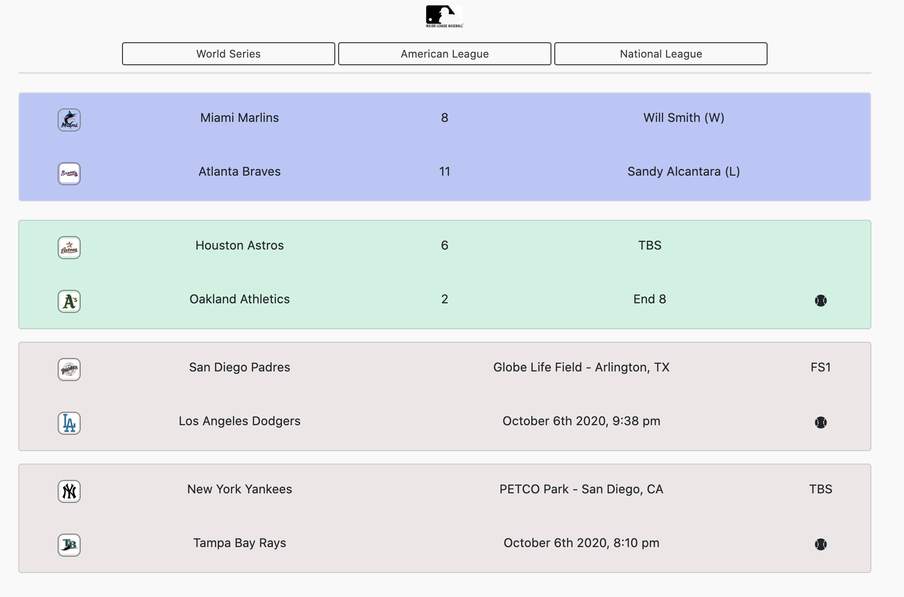

# Project 1

## Presentation Requirements

Use this [project presentation template](https://docs.google.com/presentation/d/1_u8TKy5zW5UlrVQVnyDEZ0unGI2tjQPDEpA0FNuBKAw/edit?usp=sharing) to address the following: 

* Elevator pitch: (MLB) Odds App is a minimal, lightweight live scores and odds application built on the web. It utilizes several web-based technologies and the SportsData.io API (for MLB) to track Scheduled, InProgress, and Completed odds and scores for the MLB Playoffs 2020. 

* Concept: A lightweight and clean (MLB) sports odds and live score web application.

* Process: Technologies used, include: jQuery, Vanilla JavaScript, HTML, CSS, Bootstrap as well as the SportsData.io API for MLB scores and odds. 

Disclaimer: SportsData.io Free MLB Trial allows access to almost their entire live scores and odds database. However, as a Free Trial, the odds and scores are not accurate, but the outcomes depicted are accurate. For example, in real life, Team A is leading Team B 5-2, the web application here may actually show Team A leading Team B 3-1. 

## Demo of the Application

* Demo of Futures Market Functionality on top of screen

https://drive.google.com/file/d/1u8Pcpcpz3qnYPloTvDpi2LdSGubHY7VH/view

## Access to the Application

* The URL of the deployed application

https://ac08.github.io/OddsApp/

* The URL of the GitHub repository

https://github.com/ac08/OddsApp

## Screenshots of the application during the Oct. 5th 2020 game slate.

<!-- Game Slate - Completed (Blue), InProgress (Green), Scheduled (Grey) -->

<!-- PreGame Odds Modal -->

<!-- LiveGame Odds Modal -->

